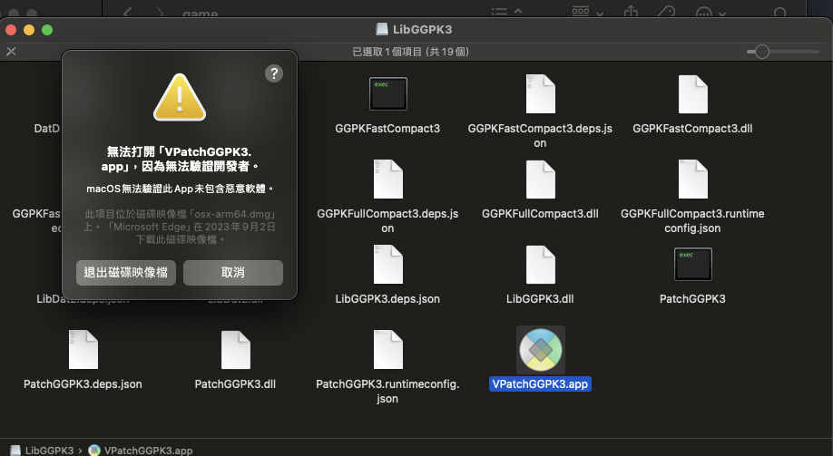
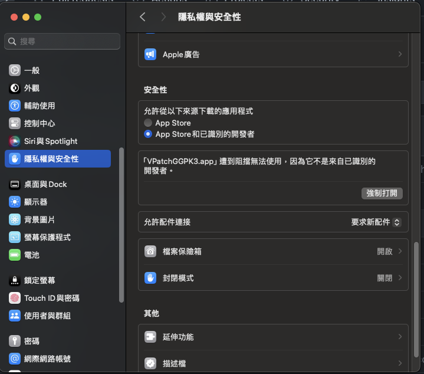

## macOS 使用方法
在下載完 [release](https://github.com/aianlinb/LibGGPK3/releases) 頁面的檔案並解壓縮後，你會得到一個檔名類似 `osx-arm64.dmg` 這樣的 dmg 檔。開啟後你會遇到一些警告頁面如下：
  
- 你需要做的事，就是在 mac 的系統設定 -> 隱私權與安全性，然後往下滑，你會看到有地方可以點。  
  
- 他叫你點**強制打開**，想中文化就點下去。
- 接著就會跳出一個與其他系統一樣的中文化小程式，一樣去雕像大[編年史](https://poedb.tw/tw/chinese)看 pin 碼，輸入後就會成功了。
